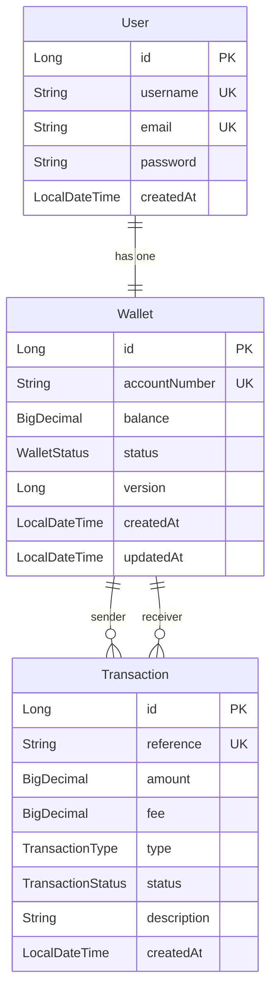

# Technical Decisions Analysis — 3Line-API

A deep-dive into every technical decision in the project, grouped by concern.

---

## 1. Framework & Language

### Spring Boot 4.0.3
**Why:** The latest major version of Spring Boot, built on top of Spring Framework 7 and Jakarta EE 11.

| Advantage | Detail |
|---|---|
| Convention over configuration | Starters like `spring-boot-starter-data-jpa` and `spring-boot-starter-security` wire up entire subsystems with zero XML |
| Production readiness | Built-in health checks, metrics, and externalized config via [application.properties](file:///Users/one/Work/3-line-api/src/test/resources/application.properties) |
| Ecosystem maturity | Vast community, well-documented, battle-tested in enterprise fintech |
| Virtual thread readiness | Spring Boot 4 is the first major version designed around Java 21's virtual threads |

### Java 21 (LTS)
**Why:** The latest Long-Term Support release with significant language and runtime improvements.

| Advantage | Detail |
|---|---|
| LTS stability | Guaranteed security patches and vendor support for years |
| Modern syntax | Records, sealed classes, pattern matching, and `var` reduce boilerplate (Lombok is still used here, but migration is trivial) |
| Virtual Threads (Project Loom) | Platform-level green threads for massive I/O concurrency — important for a payment API |
| Performance | Generational ZGC and improved JIT give measurably lower latency |

---

## 2. Security Architecture

### Stateless JWT Authentication (JJWT 0.12.6)
- Implemented in: [JwtService.java](file:///Users/one/Work/3-line-api/src/main/java/com/example/modern_api/service/JwtService.java), [JwtAuthenticationFilter.java](file:///Users/one/Work/3-line-api/src/main/java/com/example/modern_api/security/JwtAuthenticationFilter.java)
- Token generation uses **HMAC-SHA** signing via `Keys.hmacShaKeyFor()`

**Why:** A payment API must be stateless for horizontal scalability — no server-side session store is needed.

| Advantage | Detail |
|---|---|
| Scalability | Any node can validate tokens; no sticky sessions or Redis session store required |
| Decoupled auth | The secret key is externalized (`${JWT_SECRET}` env var), enabling rotation without redeployment |
| Standard | JWTs are an industry standard (RFC 7519) understood by every frontend and mobile client |

### BCrypt Password Hashing
- Configured in: [SecurityConfig.java](file:///Users/one/Work/3-line-api/src/main/java/com/example/modern_api/config/SecurityConfig.java)

**Why:** BCrypt is an adaptive hash function specifically designed for passwords.

| Advantage | Detail |
|---|---|
| Brute-force resistance | Configurable work factor makes it intentionally slow |
| Salted by default | Each hash includes a unique random salt — identical passwords produce different hashes |
| Industry standard | OWASP's recommended algorithm for password storage |

### CSRF Disabled
**Why:** CSRF protection is designed for browser-based cookie sessions. This API uses `Authorization: Bearer` headers, making CSRF attacks impossible.

### Stateless Session Policy (`SessionCreationPolicy.STATELESS`)
**Why:** Ensures Spring Security never creates an HTTP session. Combined with JWT, this keeps the API truly stateless and horizontally scalable.

### Wallet Ownership Validation
- In [TransferService.java](file:///Users/one/Work/3-line-api/src/main/java/com/example/modern_api/service/TransferService.java) (L48-54) and [WalletController.java](file:///Users/one/Work/3-line-api/src/main/java/com/example/modern_api/controller/WalletController.java) (L45-51)

**Why:** Even after JWT authentication, the system verifies the *authenticated user owns the wallet being debited*. This prevents a logged-in user from initiating transfers from someone else's wallet (an **IDOR vulnerability**).

### `@JsonIgnore` on [password](file:///Users/one/Work/3-line-api/src/main/java/com/example/modern_api/config/SecurityConfig.java#46-50) and `wallet.user`
**Why:** Prevents sensitive data from leaking in API responses. The [password](file:///Users/one/Work/3-line-api/src/main/java/com/example/modern_api/config/SecurityConfig.java#46-50) hash is never serialized, and the circular `Wallet → User` reference is broken.

### SecureRandom for Account Numbers
- In [UserService.java](file:///Users/one/Work/3-line-api/src/main/java/com/example/modern_api/service/UserService.java) (L57-63)

**Why:** `java.security.SecureRandom` uses a cryptographically strong PRNG, preventing account number prediction attacks (unlike `Math.random()` or `java.util.Random`).

---

## 3. Data Integrity & Concurrency

### Optimistic Locking (`@Version` on Wallet)
- In [Wallet.java](file:///Users/one/Work/3-line-api/src/main/java/com/example/modern_api/domain/Wallet.java) (L35-36)

**Why:** In a payment system, two concurrent transfers from the same wallet must not cause a **lost update** (double-spend).

| Advantage | Detail |
|---|---|
| No database locks | The `version` column causes Hibernate to throw `OptimisticLockException` on stale writes — no row-level locks held |
| Higher throughput | Reads are never blocked; conflicts are rare in practice and simply retried |
| Correct for fintech | Prevents double-spending at the ORM level without distributed locking infrastructure |

### Idempotency Keys
- Entities: [IdempotencyRecord.java](file:///Users/one/Work/3-line-api/src/main/java/com/example/modern_api/domain/IdempotencyRecord.java)
- Service: [IdempotencyService.java](file:///Users/one/Work/3-line-api/src/main/java/com/example/modern_api/service/IdempotencyService.java)
- Enforced in [TransferRequest](file:///Users/one/Work/3-line-api/src/main/java/com/example/modern_api/dto/TransferRequest.java#10-27) DTOs via `@NotBlank`

**Why:** Network failures and retries are inevitable in payments. Without idempotency, a retried transfer request could debit the sender twice.

| Advantage | Detail |
|---|---|
| Exactly-once semantics | Duplicate requests return the original transaction without re-processing |
| Client-controlled | The client generates unique keys (typically UUIDs), giving them control over retry behavior |
| Auditable | The `idempotency_records` table provides a replay log |

### `@Transactional` on All Write Paths
- `TransferService.transferFunds()` and `UserService.registerUser()` are both `@Transactional`

**Why:** Ensures atomicity — if the fee deduction succeeds but the receiver credit fails, the entire operation rolls back. Without this, the system could lose money.

### `BigDecimal` for All Monetary Values
**Why:** `double` and `float` cannot represent `0.10` exactly due to IEEE 754 floating-point — leading to rounding errors in financial calculations. `BigDecimal` provides arbitrary-precision decimal arithmetic.

### `@PrePersist` / `@PreUpdate` Lifecycle Callbacks
**Why:** Timestamps (`createdAt`, `updatedAt`) are set automatically by JPA, ensuring they are never null and are always accurate regardless of which code path creates the entity.

---

## 4. Database Strategy

### PostgreSQL for Production + H2 for Tests

| Environment | Database | DDL Strategy |
|---|---|---|
| Production/Dev | PostgreSQL | `ddl-auto=update` |
| Test | H2 in-memory | `ddl-auto=create-drop` |

**Why:**
- **PostgreSQL** is the most feature-rich open-source RDBMS — ACID compliant, excellent JSON support, and broadly used in fintech
- **H2 in-memory** with `create-drop` gives every test run a pristine database in milliseconds — no Docker, no startup delay, no cleanup
- Both are accessed through **JPA/Hibernate**, so the same entity definitions work on both

### Environment Variable Externalization
```properties
spring.datasource.url=${DB_URL:jdbc:postgresql://localhost:5432/modern_api}
jwt.secret=${JWT_SECRET}
```

**Why:** Secrets and connection strings come from environment variables with sensible **local defaults**. This follows the [12-Factor App](https://12factor.net/config) methodology and works seamlessly with Docker, Kubernetes, and CI/CD pipelines.

---

## 5. Domain Modeling

### Entity Hierarchy & Relationships



### Key design choices:
- **`User ↔ Wallet` is 1:1** with `CascadeType.ALL` — creating a user atomically creates their wallet (no wallet-less user is possible)
- **[Transaction](file:///Users/one/Work/3-line-api/src/main/java/com/example/modern_api/domain/Transaction.java#9-61) is effectively immutable** — once created with `SUCCESS` status, it is never modified (ledger-style)
- **Wallet has an enum status** (`ACTIVE`, `FROZEN`, `CLOSED`) — transfers are blocked for non-active wallets
- **Transaction has a unique `reference`** tied to the idempotency key — providing a traceable link between incoming requests and ledger entries

---

## 6. API Layer Decisions

### Bean Validation (`spring-boot-starter-validation`)
- Applied via `@Valid` on controller params: `@NotBlank`, `@NotNull`, `@DecimalMin`, `@Email`, `@Size`

**Why:** Validation is declarative and happens *before* business logic. Invalid requests never reach the service layer, reducing defensive checks.

### Global Exception Handler (`@RestControllerAdvice`)
- In [GlobalExceptionHandler.java](file:///Users/one/Work/3-line-api/src/main/java/com/example/modern_api/exception/GlobalExceptionHandler.java)

**Why:** Centralizes error formatting across all controllers into a consistent JSON structure: `{ "error": "..." }`. Maps domain exceptions to HTTP status codes:

| Exception | HTTP Status |
|---|---|
| [WalletException](file:///Users/one/Work/3-line-api/src/main/java/com/example/modern_api/exception/WalletException.java#3-8) | 400 Bad Request |
| [ResourceNotFoundException](file:///Users/one/Work/3-line-api/src/main/java/com/example/modern_api/exception/ResourceNotFoundException.java#3-8) | 404 Not Found |
| [InsufficientFundsException](file:///Users/one/Work/3-line-api/src/main/java/com/example/modern_api/exception/InsufficientFundsException.java#3-8) | 402 Payment Required |
| `MethodArgumentNotValidException` | 400 (field-level errors) |

### Custom Exception Hierarchy
```
RuntimeException
  └── WalletException (400)
        ├── ResourceNotFoundException (404)
        └── InsufficientFundsException (402)
```
**Why:** All exceptions are unchecked (`RuntimeException`) — they propagate naturally through `@Transactional` methods and trigger rollback. The hierarchy lets the [GlobalExceptionHandler](file:///Users/one/Work/3-line-api/src/main/java/com/example/modern_api/exception/GlobalExceptionHandler.java#12-49) map each type to the correct HTTP status.

### SpringDoc OpenAPI / Swagger UI
- Configured in [OpenApiConfig.java](file:///Users/one/Work/3-line-api/src/main/java/com/example/modern_api/config/OpenApiConfig.java)
- Controllers annotated with `@Tag`, `@Operation`

**Why:** Produces interactive, self-documenting API docs at `/swagger-ui/index.html`. Frontend and mobile developers can test endpoints directly from the browser without Postman.

---

## 7. Event-Driven Architecture

### Spring Application Events + `@Async`
- In [TransactionEventListener.java](file:///Users/one/Work/3-line-api/src/main/java/com/example/modern_api/event/TransactionEventListener.java)
- Enabled by `@EnableAsync` on [Application.java](file:///Users/one/Work/3-line-api/src/main/java/com/example/modern_api/Application.java)

**Why:** Post-transaction side effects (notifications, webhooks, audit logs) run **asynchronously** and are **decoupled** from the transfer logic.

| Advantage | Detail |
|---|---|
| Faster responses | The HTTP response returns immediately; webhook calls happen in the background |
| Decoupled | Adding new post-transfer behaviors requires only a new `@EventListener` — no changes to [TransferService](file:///Users/one/Work/3-line-api/src/main/java/com/example/modern_api/service/TransferService.java#19-112) |
| Extensible | In production, the event can be swapped for Kafka/RabbitMQ publishing without touching business logic |

---

## 8. Code Quality & Developer Experience

### Lombok
- `@Getter`, `@Setter`, `@Builder`, `@RequiredArgsConstructor`, `@Data`, `@Slf4j`

**Why:** Eliminates thousands of lines of boilerplate (getters, setters, constructors, builders, loggers). The `@Builder` pattern on entities makes test fixtures readable and fluent.

### Constructor Injection via `@RequiredArgsConstructor`
**Why:** All dependencies are `private final` fields. Lombok generates the constructor. This is the Spring-recommended injection style because:
1. Dependencies are immutable (cannot be swapped at runtime)
2. The class cannot be instantiated without all dependencies — making nulls impossible
3. It works naturally with Mockito's `@InjectMocks`

### Maven Wrapper ([mvnw](file:///Users/one/Work/3-line-api/mvnw))
**Why:** The project ships with its own Maven distribution. Contributors don't need Maven installed — `./mvnw clean install` works out of the box, ensuring reproducible builds across machines and CI.

---

## 9. Testing Strategy

### Three-Layer Test Pyramid

| Layer | File | Framework | Purpose |
|---|---|---|---|
| **Unit** | [TransferServiceTest.java](file:///Users/one/Work/3-line-api/src/test/java/com/example/modern_api/service/TransferServiceTest.java) | JUnit 5 + Mockito + AssertJ | Verifies every business rule in isolation (10 test cases covering success, idempotency, auth, edge cases) |
| **Unit** | [UserServiceTest.java](file:///Users/one/Work/3-line-api/src/test/java/com/example/modern_api/service/UserServiceTest.java) | JUnit 5 + Mockito + AssertJ | Covers registration success, duplicate username, and duplicate email |
| **Integration** | [WalletIntegrationTest.java](file:///Users/one/Work/3-line-api/src/test/java/com/example/modern_api/WalletIntegrationTest.java) | `@SpringBootTest` + MockMvc | Full lifecycle: register → login → transfer → verify balances with a real H2 DB and Spring Security |

### Key testing decisions:
- **`MockedStatic<SecurityContextHolder>`** — the unit tests mock the thread-local security context to simulate authenticated users without loading Spring
- **AssertJ's `isEqualByComparingTo`** — used for `BigDecimal` assertions to avoid scale mismatches (`100.00` vs `100`)
- **UUID-based usernames in integration tests** — prevents test interference when the database is not fully reset between test methods
- **H2 `create-drop` in tests** — every test run starts with a blank schema, ensuring true isolation

---

## 10. Transfer Flow — Putting It All Together

The [transferFunds()](file:///Users/one/Work/3-line-api/src/main/java/com/example/modern_api/service/TransferService.java#30-96) method in [TransferService.java](file:///Users/one/Work/3-line-api/src/main/java/com/example/modern_api/service/TransferService.java) executes an 8-step pipeline, each step reflecting a distinct technical decision:

```
1. Idempotency check     → prevents duplicate processing
2. Wallet lookup          → repository pattern with Optional
3. Ownership validation   → IDOR prevention (SecurityContext)
4. Business validation    → self-transfer, status, amount checks
5. Fee calculation        → BigDecimal arithmetic (1% fee)
6. Balance mutation       → optimistic locking via @Version
7. Transaction record     → immutable ledger entry
8. Event publishing       → async webhook simulation
```

All steps execute inside a single `@Transactional` boundary — if **any** step throws, the entire operation rolls back.
